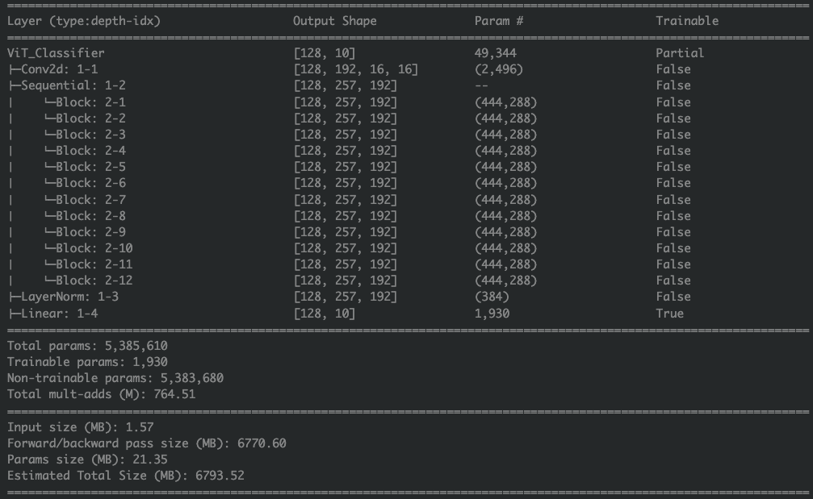

# Эксперименты с автоэнкодером и классификацией

## Задача

Найти автоэнкодер для классификации изображений, который бы: 

* обеспечивал хорошую точность на выходе
* имел не слишком сложную архитектуру для простоты реализации и поддержки
* и не требовал слишком больших вычислительных ресурсов на этапе обучения

## Идея

Для выбора архитектуры автоэнкодера я избирательно просмотрел State of the art решения за последние пару лет:

[](https://paperswithcode.com/sota/self-supervised-image-classification-on)

В итоге остановился на идеи из статьи [Masked Autoencoders Are Scalable Vision Learners](https://arxiv.org/abs/2111.06377).

Архитектура основа на трансформерах, выглядит так:


Идея в том, чтобы на этапе обучения подавать на вход модели только несколько фрагментов изображения для борьбы с переобучением. Кроме экономии на энокдинге изображения (выбрасывается порядка ~75% картинки), снижается еще и потребность в аугументациях.

Выглядит это так:


## Параметры архитектуры и обучение

На вход модели подавал 32х32 изображения из Cifar10, никаких аугументаций не делал.

Размерность скрытого представления выбрал emb_dim=192. У авторов архитектуры оно побольше, но они тестировались на ImageNet-1K, там в 100 раз больше данных и разрешение тоже больше. Для исключения переобучения сразу поставил скрытое представление небольшим.

Автоэнкодер обучал 12 часов на Nvidia T4, 330 эпох.

Качество оценивал по MSE и чисто визуально


На валидационном датасете ...

Ради экономии времнии, качество автоэнкодера оценивал максимально просто

визуально + точность

скрин тензорборда

код здесь: 

стрался использовать готовые куски, чтобы не переизобретать велосипед и меньше времени тратить на отладку

torchinfo summary

## Классификатор на скрытом представлении

Модель простейшая ...

качество классификатора на 




## Выводы и размышления

Прогонка автоэнкодера на валидационном и тестовом датасетах. 
Тщательный выбор гиперпараметров


запуск без заморозки, запуск  с заморозкой

## Репликация результатов

```
python3.10 -m pip install torch torchvision notebook ipywidgets torchinfo pytest matplotlib tensorboard tqdm timm torchinfo

python -m pip install -e .
``````
