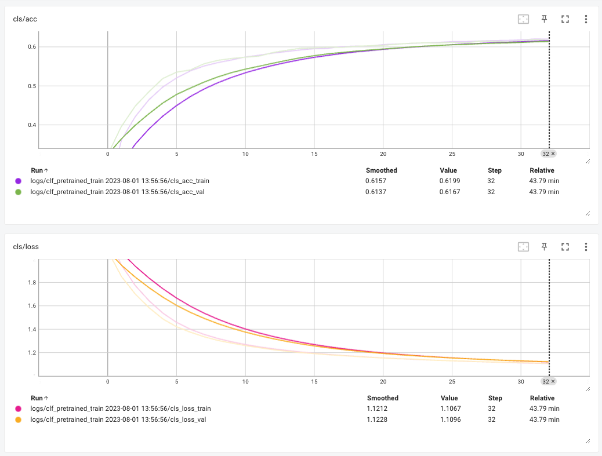

# Эксперименты с автоэнкодером и классификацией

## Задача

Найти автоэнкодер для классификации изображений, который бы: 

* обеспечивал хорошую точность на выходе
* имел не слишком сложную архитектуру для простоты реализации и поддержки
* и не требовал слишком больших вычислительных ресурсов на этапе обучения

## Идея

Для выбора архитектуры автоэнкодера я избирательно просмотрел State of the art решения за последние пару лет:

[](https://paperswithcode.com/sota/self-supervised-image-classification-on)

В итоге остановился на идеи из статьи [Masked Autoencoders Are Scalable Vision Learners](https://arxiv.org/abs/2111.06377).

Архитектура основа на трансформерах и выглядит так:


Идея в том, чтобы на этапе обучения подавать на вход модели только несколько фрагментов изображения для борьбы с переобучением. Кроме экономии на энокдинге изображения (выбрасывается порядка ~75% картинки), снижается еще и потребность в аугументациях.

Работа модели на данных Cifar10:


## Параметры архитектуры и обучение

На вход модели подавал 32х32 изображения из Cifar10, никаких аугументаций не делал.

Размерность скрытого представления выбрал emb_dim=192. У авторов архитектуры оно побольше, но они тестировались на ImageNet-1K, там в 100 раз больше данных и разрешение тоже больше. Для исключения переобучения сразу поставил скрытое представление небольшим.

Автоэнкодер обучал 12 часов на Nvidia T4, 330 эпох.

Качество оценивал по MSE:


А также чисто визуально:


Код модели здесь: src/autoencoder_v2/model.py


При реализации велосипеды старался не изобретать, использовал готовы блоки, где возможно.

## Классификатор на скрытом представлении

Модель простейшая: один линейный слой сразу за энкодером из автоэнкодера.

Для оценки качества считал accuracy на обучающем и валидационном датасетах:


Была гипотеза, что автоэнкодер настолько хорошо подготовит энкодер, что его не потребуется дообучать. И в результате можно будет сильно сэкономить на обучении. Для проверки заморозил все веса энкодера и обучал только один слой классификатора:



Как видно на графике, гипотеза не подтвердилась — за одно время модель пробежала в три раза больше эпох, но точность вышла ниже плинтуса. Возможно, надо было побольше слоев для классификатора оставить. Можно пораскапывать дальше, при желании.

## Выводы и размышления

* Masked Autoencoder работает: позволяет получить неплохую точность при пониженных требованиях к ресурсам
* Архитектура модели не супер сложная, но и не тривиальная — реализовать без ошибок с первого раза оказалось не очень просто

В целом, задача исследования решена. 

### Для дальнейших иследований

Я бы выдел два направляения:

1. поиск более простой и эффективной архитектуры (выкинуть побольше слоев из блоков трансформера, проверить осмысленность хитрой инициализации весов, etc)

2. адаптировать применение масок для сверточной архитектуры (такие работы уже есть, но, кажется, тут еще есть что пораскапывать)


## Репликация результатов

В репозиторий подгружены веса и логи экспериментов (они небольшие):

* weights/vit-t-mae.pt: веса автоэнкодера
* weights/vit-t-classifier-pretrained.pt: веса классификатора на основе автоэнкодера
* logs/: логи из тензорборды

Для запуска на своей машине надо поставить зависимости:

```
python3.10 -m pip -r requirements.txt

pip install -e .
``````
